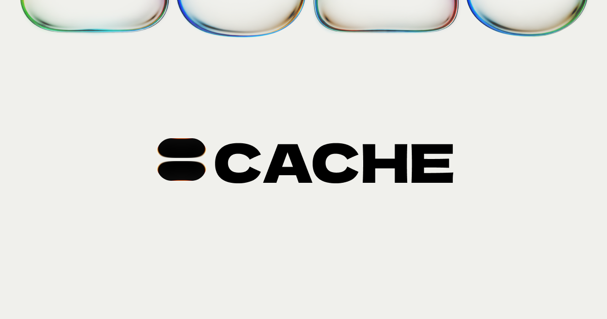

<p align="center">
  <a href="https://www.cachd.app" target="_blank" rel="noopener noreferrer">
    
  </a>
</p>

<p align="center">Unify your bookmarks across every platform into a single, searchable, actionable library.</p>

<p align="center">
  <a href="https://www.cachd.app" target="_blank" rel="noopener noreferrer"></a>
  <a href="https://docs.cachd.app" target="_blank" rel="noopener noreferrer"></a>
  <a href="./LICENSE"></a>
  <a href="https://github.com/rortan134/cache-app/releases"></a>
  <a href="./CODE_OF_CONDUCT.md"></a>
  <a href="./CONTRIBUTING.md"></a>
  <a href="https://twitter.com/gsmmtt" target="_blank" rel="noopener noreferrer"></a>
</p>

<p align="center">
  <a href="#features">Features</a> •
  <a href="#why">Why</a> •
  <a href="#tech-stack">Tech Stack</a> •
  <a href="#roadmap">Roadmap</a> •
  <a href="#contributing">Contributing</a> •
  <a href="#license">License</a>
</p>

---

## Features

- **Unified Library** — First-class support for bookmarks from Instagram Saved, TikTok Favorites, YouTube Watch Later, X/Twitter Bookmarks, GitHub Stars, Chrome bookmarks, Pinterest, Google Photos, and more, all in one place. Unlike other tools that cap saves, Cache has no limits.
- **Smart Collections** — Organize entries into collections with AI-assisted relevance ranking.
- **AI-Assisted Search** — Ask the Cache AI agent and search across all your saved content.
- **AI-Powered Synthesis** — Create Automations to generate daily, weekly, and monthly digests, and much more. Cache even learns your preferences over time.
- **Note-taking** — First-party WYSIWYG notes alongside bookmarks.
- **Browser Extension** — Chrome extension web clipper that captures and syncs saved content from anywhere.
- **Export & Integrate** — Pipe results into other tools you already use. Share collections with others.
- **Simple and Low Maintenance** — Cache is designed to be simple, low-maintenance, and always portable.

---

## Why

Bookmarking is broken. When you hit "save" on a tweet, a video, or a post, you are making a deliberate decision that *this is worth remembering*. But that intent is immediately lost. It vanishes into a list you never revisit, scattered across a dozen platforms with no connection to your actual workflow or goals. The feeds are designed to keep you scrolling, not to help you resurface what you need. Existing tools treat the "save" action as an afterthought, a dead end rather than a starting point.

Cache exists because that signal is too valuable to waste. It treats the act of saving as a first-class event and builds the entire experience around turning that intent into action. It does not replace your platforms; it respects the intent behind why you use them and gives it a destination.

## Quickstart

### Cloud-hosted: [www.cachd.app](https://www.cachd.app)

<a href="https://www.cachd.app" target="_blank" rel="noopener noreferrer"></a>

### Self-hosting (Work-in-progress)

You can self-host Cache for total control over your data and design. Cache has zero telemetry by default.

### Prerequisites

- [Bun](https://bun.sh/) v1.3.14+
- [Node.js](https://nodejs.org/) 24.x
- PostgreSQL 12+ (local or remote)
- A Google Gemini API key (for AI features)

### Local Development

```bash
# Clone the repository
git clone https://github.com/rortan134/cache-app.git
cd cache

# Install dependencies
bun install

# Set up environment
cp .env.example .env
# Edit .env with your database URL and API keys

# Set up the database
bun run db-deploy

# Start the development server
bun run dev
```

Open [http://localhost:3000](http://localhost:3000).

---

## Tech Stack

| Category                  | Technology                                                                                                             |
| ------------------------- | ---------------------------------------------------------------------------------------------------------------------- |
| **Framework**             | [Next.js](https://nextjs.org/) (App Router)                                                                            |
| **Runtime**               | [Bun](https://bun.sh/), [Node.js](https://nodejs.org/)                                                                 |
| **UI**                    | [React](https://react.dev/), [Base UI](https://base-ui.com/), [Tailwind CSS](https://tailwindcss.com/)                 |
| **Icons**                 | [lucide-react](https://lucide.dev/)                                                                                    |
| **Rich Text**             | [Lexical](https://lexical.dev/), [Streamdown](https://github.com/vercel/streamdown)                                    |
| **Database**              | PostgreSQL via [Prisma](https://www.prisma.io/), Redis                                                                 |
| **Auth**                  | [Better Auth](https://better-auth.com/) (Google, GitHub, X, Pinterest OAuth)                                           |
| **Validation**            | [Zod](https://zod.dev/), [@t3-oss/env-nextjs](https://env.t3.gg/)                                                      |
| **AI/LLM**                | [Vercel AI SDK](https://sdk.vercel.ai/), [Google Gemini](https://ai.google.dev/), [@workflow/ai](https://workflow.ai/) |
| **Agentic Web Search**    | [Tavily](https://tavily.com/)                                                                                          |
| **Data Fetching**         | [SWR](https://swr.vercel.app/), [nuqs](https://nuqs.vercel.app/)                                                       |
| **i18n**                  | gt-next (en-US, fr-FR, es-ES, pt-BR)                                                                                   |
| **Payments**              | [Stripe](https://stripe.com/)                                                                                          |
| **Workflows**             | [workflow](https://workflow.ai/), [Vercel Cron Jobs](https://vercel.com/docs/cron-jobs)                                |
| **MCP**                   | [MCP SDK](https://modelcontextprotocol.io/)                                                                            |
| **Security (Cloud only)** | [Arcjet](https://arcjet.com/) (WAF, rate limiting, PII redaction, prompt injection detection)                          |
| **Linting**               | [Ultracite](https://ultracite.dev/) (Biome)                                                                            |
| **React Compiler**        | [babel-plugin-react-compiler](https://react.dev/learn/react-compiler) (auto-memoization)                               |
| **Date Handling**         | [Day.js](https://day.js.org/), [chrono-node](https://github.com/wanasit/chrono)                                        |
| **Deployment**            | [Vercel](https://vercel.com/), [Unkey](https://unkey.com/)                                                             |

---

## Roadmap

- **Comments** — Add and view threaded comments on entries.
- **Inbox view** — Triage view for reviewing entries.
- **PDF Support** — Upload, store, and search within PDF documents alongside bookmarks.
- **Notes improvements** — Richer editing experience, advanced formatting.
- *More coming soon*

---

## Contributing

We welcome contributions! Please see our [Contributing Guide](CONTRIBUTING.md) for details.

Open an [issue](https://github.com/rortan134/cache-app/issues?q=sort%3Aupdated-desc+is%3Aissue+state%3Aopen+) if you believe you've encountered a bug.

This project follows the [Contributor Covenant](CODE_OF_CONDUCT.md) code of conduct.

---

## License

This project is licensed under the Apache License 2.0 - see the [LICENSE file](LICENSE) for details.
