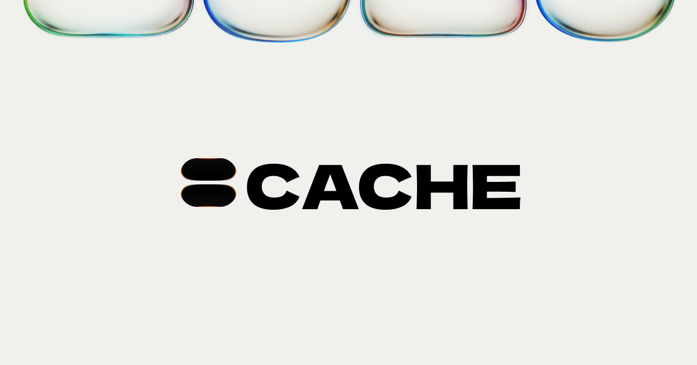

# Cache App

<a href="https://www.cachd.app" target="_blank" rel="noopener noreferrer"></a>
<a href="https://docs.cachd.app" target="_blank" rel="noopener noreferrer"></a>
<a href="./LICENSE"></a>
<a href="https://github.com/rortan134/cache-app/releases"></a>
<a href="./CODE_OF_CONDUCT.md"></a>
<a href="https://twitter.com/gsmmtt" target="_blank" rel="noopener noreferrer"></a>

**Unify your bookmarks across platforms into a single actionable library.** Cache is the AI bookmark manager for busy people. Collect, organize, and rediscover everything you've saved across platforms.

**[cachd.app](https://cachd.app)** · [Issues](https://github.com/rortan134/cache-app/issues)

[](https://www.cachd.app)

## Why Cache

Bookmarking is broken. When you hit "save" on a tweet, a video, or a post, you are making a deliberate decision that _this is worth remembering_. But that intent is immediately lost. It vanishes into a list you never revisit, scattered across a dozen platforms with no connection to your actual workflow or goals. The feeds are designed to keep you scrolling, not to help you resurface what you need. Existing tools treat the "save" action as an afterthought, a dead end rather than a starting point.

Cache exists because that signal is too valuable to waste. It treats the act of saving as a first-class event and builds the entire experience around turning that intent into action. It does not replace your platforms; it respects the intent behind why you use them and gives it a destination.

<a href="https://deepwiki.com/rortan134/cache-app" target="_blank" rel="noopener noreferrer"></a>

## What Cache does for you

- **Unify your bookmarks** — Integrate Cache into your day-to-day with first-class support for bookmarks from Browser bookmarks, Instagram Saved, TikTok Favorites, YouTube Watch Later, X/Twitter bookmarks, GitHub Stars, Pinterest, Google Photos, MCP, and more, all in one place. Unlike other tools that cap saves, Cache has no limits.
- **Smart collections** — Automatically organizes entries into your collections with AI-assisted relevance ranking. Cache even learns your preferences over time.
- **Overviews** — See a 1-line summary above every collection. As new entries are added, it updates instantly. And if you want to see more detail, just hit expand.
- **AI-assisted search** — Ask the Cache AI agent and search across all your saved content.
- **Automations** — Create custom agents to do anything. Generate daily digests, summaries, weekly reminders, and much more.
- **Note-taking** — First-party note-taking support alongside bookmarks.
- **Collaboration** — Share a live view of any collection with anyone, even if they don't use Cache.
- **Browser extension** — Capture and sync saved content from anywhere on the web.
- **Export & integrate** — Pipe results into other tools you already use.
- **Simple and low maintenance** — Cache is designed to be simple, low-maintenance, and portable.

---

## Quickstart

### Cloud-hosted: [www.cachd.app](https://www.cachd.app)

<a href="https://www.cachd.app" target="_blank" rel="noopener noreferrer"></a>

### Self hosting

You can self-host Cache for total control over your data and design. Cache has zero telemetry by default.

### Prerequisites

- [Bun](https://bun.sh/) v1.3.14
- [Node.js](https://nodejs.org/) 24.x
- PostgreSQL 12+ (local or remote)
- A Google Gemini API key (for AI features)
- Docker (optional)

### Local Development

```bash
# Clone the repository
git clone https://github.com/rortan134/cache-app.git
cd cache

# Install dependencies
bun install

# Set up environment
cp .env.example .env
# Edit .env with your database URL and API keys

# Set up the database
bun run db-deploy

# Start the development server
bun run dev
```

Open [http://localhost:3000](http://localhost:3000).

### Environment Variables

See the [environment variables reference](.env.example) for the full list.

## Tech Stack

<details>
<summary>Next.js · Bun · PostgreSQL · Prisma ORM · Better Auth · Tailwind — and more</summary>

<a href="https://www.typescriptlang.org"></a>
<a href="https://prisma.io"></a>
<a href="https://tailwindcss.com/"></a>

| Category                  | Technology                                                                                                      |
| ------------------------- | --------------------------------------------------------------------------------------------------------------- |
| **Framework**             | [Next.js](https://nextjs.org/) (App Router)                                                                     |
| **UI**                    | [React](https://react.dev/), [Base UI](https://base-ui.com/), [Tailwind CSS](https://tailwindcss.com/)          |
| **Rich Text**             | [Lexical](https://lexical.dev/), [Streamdown](https://github.com/vercel/streamdown)                             |
| **Database**              | PostgreSQL, Redis                                                                                               |
| **Auth**                  | [Better Auth](https://better-auth.com/)                                                                         |
| **Validation**            | [Zod](https://zod.dev/), [@t3-oss/env-nextjs](https://env.t3.gg/)                                               |
| **AI/LLM**                | [AI SDK](https://sdk.vercel.ai/), [AI Gateway](https://vercel.com/ai-gateway), [Gemini](https://ai.google.dev/) |
| **Agentic Web Search**    | [Tavily](https://tavily.com/)                                                                                   |
| **Data Fetching**         | [SWR](https://swr.vercel.app/), [nuqs](https://nuqs.vercel.app/)                                                |
| **i18n**                  | [gt-next](https://generaltranslation.com)                                                                       |
| **Subscriptions**         | [Stripe](https://stripe.com/)                                                                                   |
| **Durable Execution**     | [Workflow SDK](https://workflow-sdk.dev/)                                                                       |
| **Security (Cloud-only)** | [Arcjet](https://arcjet.com/) (WAF, rate limiting, PII redaction)                                               |
| **Linting**               | [Ultracite](https://ultracite.dev/) (Biome)                                                                     |
| **Date Handling**         | [Day.js](https://day.js.org/), [chrono-node](https://github.com/wanasit/chrono)                                 |

</details>

---

## Cache App MCP

Cache exposes an [MCP](https://modelcontextprotocol.io/) server so AI agents like Claude, Cursor, and others can read and write your library directly. Search bookmarks, save new items, list collections, and more.

Endpoint: `https://www.cachd.app/mcp`

- [llms.txt](https://www.cachd.app/llms.txt) — agent context and tool reference
- Generate a setup prompt with your Bearer token from the app (Integrations → MCP)

---

## Roadmap

- **Remind me** — Set up unique reminders when saving or browsing on items to come back to later.
- **Inbox view** — Triage view for reviewing entries.
- **Smart collection controls** — Review suggestions and control automatic assignment for each collection.
- **Raycast integration** — Capture and search Cache from Raycast.
- **Substack integration** — Import and save Substack posts and newsletters.

---

## Contributing

We welcome contributions! Please see our [Contributing Guide](CONTRIBUTING.md) for details.

Open an [issue](https://github.com/rortan134/cache-app/issues?q=sort%3Aupdated-desc+is%3Aissue+state%3Aopen+) if you believe you've encountered a bug.

This project follows the [Contributor Covenant](CODE_OF_CONDUCT.md) code of conduct.

---

## License

This project is licensed under the Apache License 2.0 - see the [LICENSE file](LICENSE) for details.
